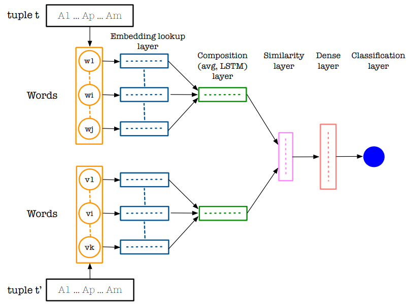

% Novel Applications of AI Techniques in Database Management
% Johannes Wünsche
% Faculty of Informatics, Otto-von-Guericke University, Magdeburg

---
aspectratio: 169
theme: Rochester
colortheme: crane
fonttheme: professionalfonts
---

### Agenda

\tableofcontents
Overview
========

### Overview
\begin{center}
\includegraphics[height=0.95\textheight]{overview.pdf}
\end{center}

Short Summary of Natural Language Interfaces, ML in DB and Data Managment Applications
=======================================================================================

### Natural Language Interfaces & ML in DB

#### Natural Language Interfaces
- Idea of using AI to interpret NL questions or requests and react accordingly
- quite old concept improved by modern hardware and technology

#### Machine Learning in Databases
- machine learning methods on data
- e.g. *Apache MADlib*, which implements
	+ decision trees
	+ random forest
	+ bayes classifier
	+ clustering
	+ association rules
	+ ...

### Data Management Applications

{ height=50% }

#### Entity Resolution
- Finding of Records that refer to the same entity
- Required if shape of data is not unitary

Self-Management of Databases
============================

### Self-Management of Databases

- _Tuning of parameters of Database Management Systems_
  + like cache amount and frequency of writing to storage
  + implementations like OtterTune *by Database Research Group at Carnegie Mellon University*
- _Elastic Scaling of Machine Allocation_
  + avoid latency spikes by action prediction through time-series prediction
  + implementations like P-Store *by Taft, MIT*
- _Learned Index Structures_
  + a "model can learn the sort order or structure of lookup keys and use this signal to effectively predict the position or existence of records"
  + alternative technology to exisiting Bloom-Filters or B-Trees

### B-Tree Bloom-Filter
\includegraphics[width=0.45\textwidth]{B-tree.png}
\includegraphics[width=0.45\textwidth]{Bloom_filter.png}

### Learned Index Structures

#### What's the difference between Learned Index Structures and existing Models?

\includegraphics[width=\textwidth]{learnedindexvbtree.png}

### Learned Index Structures
- Performance of Index Access can be unintuitively enhanced by predicting the index of a searched instance with a Neural Network or Linear Regression
- Shown to result in equally good or better performance than conventional Index Structures

### Learned Index Structures by Example

#### Searching for a index
- Similar to every other model used
- Transform key to vector and use as input for trained NN

### Enhancement of LIS: Recursive Model Index(RMI)
\begin{center}
\includegraphics[height=0.6\textheight]{rmi.png}
\end{center}
- refinement of models after every step to better display details
- 

### Learned Index Strucutures Result

### Learned Index Structures Conclusion

#### Advantages
- can take advantage of real world data patterns(ML) &rarr; allows for high optimization
- lower engineering costs

#### Disadvantages
- initial work on B-Trees and alike is lower since they do not require additional training

Software 2.0
============

### Intro

-   Classical Software Dev major downsides like difficult optimization
    of code and human error

-   S2.0 doesn't base on declarative programming and tries to learn the
    desired functionality with a approximate base net

- enabled by development of Neural Networks in last 20 years allowing >100 layers deep networks

-   program space is restricted for future training (backpropagation,
    gradien descent)

-   many real world problems easier to detect desirable behaviour than
    to write a specific program

### Advantages

#### Higher Portability

-   Smaller operation set
  + Matrix Multiplication and thresholding at zero required
-   small instruction set of chips with pretrained nets allows for

#### Better Performance

-   allows for better performance and correctness predictions because
    closer implementation in hardware less core primitives are needed
-   modules can be introduced to a single module reducing communication
    overhead by sacrificing clarity of separation, which is due to the
    human unlike nature of so2 sacrificed beforehand either way
-   well trained neural nets outperform code implementation

### Advantages
\begin{center}
\includegraphics[height=0.5\textheight]{so2.png}
\end{center}

#### Better Runtime Predictability
-   requires same amount of memory each iteration &rarr; low
probability of infinite loops or locks
-   speed well adjustable &rarr; speed can easily improved by reducing
performance

### Disadvantages

#### Unintuitivity
- can be treated as different new paradigm &rarr; requires rethinking of development style
-   even though the network may work well, for humans difficult to
    understand
-   developing in so2 is unintuitive and not well developed
- requires manually curating, maintaining, cleaning and labelling of datasets
- may not be applicable easily to all problems

### Disadvantages

#### Nonrecognizable errors
-   errors may occur unpredictable
-   can silently fail due to changed biases (hard to track since a large
    amount of them are being trained)

#### Lack of Tools
- no tools exist that support the development process like IDE, highlighting and alike for classical software

### Example

#### Cuttlefish
\includegraphics[width=\textwidth]{cuttle.png}

### Conclusion

#### Optimization
- Allows for greater optimization of complex problems
- e.g. Cuttlefish achieves 7.5x speedup to other query optimizers *Cuttlefish: A Lightweight Primitive for Adaptive Query Processing*

#### Development difficult
- No Tools and unexperienced developers

### Thank you for your attention.

Do you have any questions? Ideas?  
Be free to ask them.
