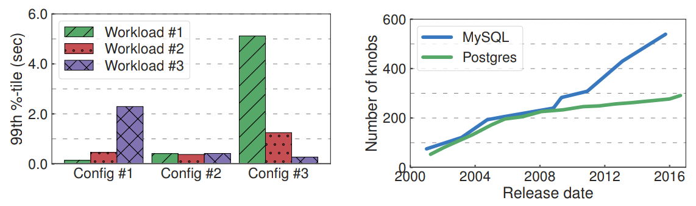

% Novel Applications of AI Techniques in Database Management
% Johannes Wünsche
% Faculty of Informatics, Otto-von-Guericke University, Magdeburg

---
aspectratio: 169
theme: Rochester
colortheme: crane
fonttheme: professionalfonts
---

Overview of AI Techniques in Database Management
================================================

### Overview of AI Techniques in Database Management
\begin{center}
\includegraphics[height=0.95\textheight]{overview.pdf}
\end{center}

### Agenda

\tableofcontents

Short Summary of Natural Language Interfaces, ML in DB and Data Managment Applications
=======================================================================================

### Natural Language Interfaces & ML in DB

#### Natural Language Interfaces
- Idea of using AI to interpret NL questions or requests and react accordingly
- Quite old concept improved by modern hardware and technology

{ width=90% }

---

#### Machine Learning in Databases
- Machine learning methods on data
- Reduces data movement by putting libraries in the database
- e.g. 2010s Parameter Server(distributed training), Apache Spark(framework for distribution of tasks for analytics), *Apache MADlib*, which implements
	+ bayes classifier
	+ clustering
	+ association rules
	+ ...
- or 2000s *scikit-learn*(easy to use ML-library)
- 90s *R* and *Weka*

### Data Management Applications

{ height=50% }

#### Entity Resolution
- Finding of Records that refer to the same entity
- Required if data does not have a single representation

Self-Management of Databases
============================

### Self-Management of Databases

- _Elastic Scaling of Machine Allocation_
  + avoid latency spikes by action prediction through time-series prediction
  + implementations like P-Store *by Taft, MIT*

{ height=60% }

### Self-Management of Databases

- _Tuning of parameters of Database Management Systems_
  + like cache amount and frequency of writing to storage
  + implementations like OtterTune *by Database Research Group at Carnegie Mellon University*

{ width=90% }

### Self-Management of Databases

- _Peloton - Self Driving Database_
	+ replacement of human database manager
	+ DBMS designed to optimize latency

### Overview of AI Techniques in Database Management
\begin{center}
\includegraphics[height=0.95\textheight]{overview.pdf}
\end{center}

### Learned Index Structures

#### _Learned Index Structures_
  + a "model can learn the sort order or structure of lookup keys and use this signal to effectively predict the position or existence of records"
  + alternative technology to exisiting Bloom-Filters or B-Trees

### Learned Index Structures

#### What's the difference between Learned Index Structures and existing Approaches?

### Learned Index Structures
- Performance of Index Access can be unintuitively enhanced by predicting the index of a searched instance with a Neural Network or Linear Regression
- Shown to result in equally good or better performance than conventional Index Structures

### Learned Index Structures by Strategies

#### Searching the index of a key
- Similar to every other model used
- Transform key to vector and use as input for trained NN
- Result will be the index of the searched key
- Effective for read-only database

---

#### Inserting or Updating a key
- *Append*
	+ possible but only in a few cases
	+ like adding sequential logs in order
	+ LIS can learn the pattern also for future data
	+ appending reduced to $O(1)$
	+ to compare B-Trees need in any case $O(\text{log } n)$
- *Insert in the middle*
	+ theoretically possible, but practically difficult
	+ can similarly be prelearned
	+ but moving of data or reservation of space might be required

### Learned Index Structures Result

### Enhancement of LIS: Recursive Model Index(RMI)

---

- Refinement of models after every step
- Easier to achieve than one large model
- After one layer is completed the result will be moved to the according lower level model until a leaf is reached
- Enable mixture of different technologies to optimize the model
	+ NN
	+ Linear Regression
	+ B-Trees
	+ ...

- They are also applicable for hashmaps and Bloomfilter replacements

### RMI Example

1. Classification
	1. Use key as input
	2. Calculate output of the classification neural network
	3. 1 - 12 - 8 - 4 (Example Construction)
	4. Apply sigmoid to output &rarr; highest value model get chosen
2. Linear Regresssion
	1. 1 - 8 - 1 Auto Encoder
	2. Result is predicted position

### Performance of RMI Example
\begin{tabular}{l r r}
	& LIS(in microseconds) & B-Tree(in microseconds)\\ \hline
	Sequential keys & & \\ \hline
	Lookup key & 1516 & 399 \\
	Lookup key, fetch from array & 3408 & 2972 \\
	Lookup key, fetch from index & 3408 & 10140 \\ \hline
	Random keys within a range \\ \hline
	Lookup key & 1563 & 1845 \\
	Lookup key, fetch from array & 3524 & 4241 \\
	Lookup key, fetch from index & 3524 & 11555 \\
\end{tabular}

Table 1: *Inference time comparison between learned index structure and B-Tree, measurements from Taranpreet Kaur's  Master Thesis *

### Learned Index Structures Conclusion

#### Advantages
- Can take advantage of real world data patterns(ML) &rarr; allows for high optimization
- Lower engineering costs
- Can lead to quicker adjustment of models during runtime

#### Disadvantages
- Initial work on B-Trees and alike is lower since they do not require additional training
- Some open questions still remain as well as long term performance tests in real world systems

Optimization by "Software 2.0"
==============================

### Intro

-   Major downsides like difficult optimization
    of code and human error in classical software development

-   Doesn't base on declarative programming and tries to learn the
    desired functionality with a approximate base net

-   Enabled by development of Neural Networks in last 20 years allowing >100 layers deep networks

-   Program space is restricted for future training (backpropagation,
    gradient descent)

-   Many real world problems easier to detect desirable behaviour than
    to write a specific program

### Advantages

#### Higher Portability

-   Smaller operation set
  + Matrix Multiplication and thresholding at zero required
-   Small instruction set of chips with pretrained nets allows for cheap and specialised hardware

#### Better Performance

-   Allows for better performance and correctness predictions because
    closer implementation in hardware less core primitives are needed
-   Modules can be introduced to a single module reducing communication
    overhead by sacrificing clarity of separation, which is due to the
    human unlike nature of S2.0 sacrificed beforehand either way
-   Well trained neural nets outperform code implementation

### Advantages
{ height=40% }

#### Better Runtime Predictability
- Requires same amount of memory each iteration &rarr; low
probability of infinite loops or locks
- Speed well adjustable &rarr; speed can easily improved by reducing
performance

master thesis taranpreet kaur table note

### Disadvantages

#### Unintuitivity
- Can be treated as different new paradigm &rarr; requires rethinking of development style
- Even though the network may work well, for humans difficult to
  understand
- Developing S2.0 is unintuitive and not well developed
- Requires manually curating, maintaining, cleaning and labeling of datasets
- May not be applicable easily to all problems

### Disadvantages

#### Nonrecognizable errors
-   Errors may occur unpredictable
-   Can silently fail due to changed biases (hard to track since a large
    amount of them are being trained)

#### Lack of Tools
- No tools currently exist that support the development process like IDE, highlighting and alike as for classical software

#### Low Experience
- Effective in some implementations but not as general approach

### Conclusion

#### Optimization
- Allows for greater optimization of specific complex problems
- e.g. Cuttlefish achieves 7.5x speedup to other query optimizers *Cuttlefish: A Lightweight Primitive for Adaptive Query Processing*

#### Development difficult
- No Tools and unexperienced developers
- Generally low usage experience

### Thank you for your attention.

Do you have any questions? Ideas?  
Be free to ask them.

### Sources
KRASKA, Tim, et al. The case for learned index structures. In: Proceedings of the 2018 International Conference on Management of Data. ACM, 2018. S. 489-504.a

KAFTAN, Tomer, et al. Cuttlefish: A Lightweight Primitive for Adaptive Query Processing. arXiv preprint arXiv:1802.09180, 2018.

EBRAHEEM, Muhammad, et al. DeepER--Deep Entity Resolution. arXiv preprint arXiv:1710.00597, 2017.

https://medium.com/@karpathy/software-2-0-a64152b37c35 - Andrej Karpathy Software 2.0

http://madlib.apache.org/ - Apache MadLIB Information

